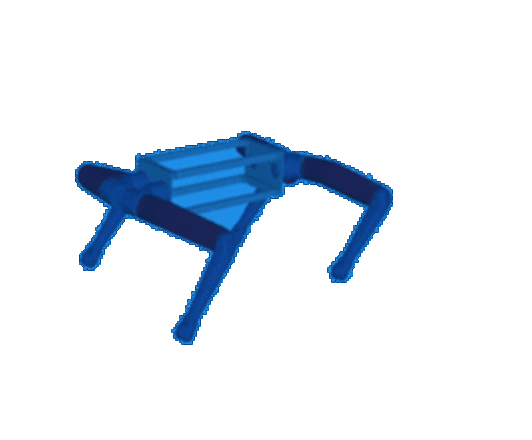
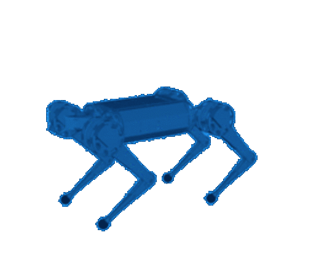

<!-- Animated Waving Header Banner -->

  

<!-- Animated Typing Terminal -->

  

 

<table align="center" style="border-collapse: collapse; border: none; width: 100%;">
  <tr style="border: none;">
    <td width="60%" valign="top" style="border: none;">
      <h3>Engineering Focus & Architecture</h3>
      

        I am an engineer dedicated to the synthesis of <b>Control Theory</b>, <b>Low-level Driver Architecture</b>, and <b>Robotic Autonomy</b>. My structural approach focuses on constructing deterministic systems capable of complex real-world interaction—from implementing state-machine-driven gait generation for multi-axis robots to writing direct bare-metal firmware for microcontrollers.
      

      <h4> Current Engineering Initiatives</h4>
      <ul>
        <li> <b>Simulating Autonomy:</b> Orchestrating a Quadcopter Simulation utilizing modern middleware (<b>ROS 2 Jazzy</b> & <b>Gazebo</b>).</li>
        <li> <b>Quadruped Locomotion:</b> Architecting Inverse Kinematics and IMU-based balance stabilization using <b>MATLAB</b> & <b>CoppeliaSim</b>.</li>
        <li> <b>Hardware Proximity:</b> Crafting Register-Level <b>Bare-Metal C</b> drivers tailored for <b>STM32</b> (UART, CAN, PWM, ADC).</li>
        <li> <b>Machine Intelligence:</b> Researching stochastic optimization via <b>Genetic Algorithms</b> and biologically inspired Neural Networks.</li>
      </ul>
      <blockquote>
        
 <i><b>Inquiries welcome regarding:</b> Control Theory (PID, FLC, SMC, MPC, VMC), FPGA Design (Verilog), RTOS ecosystems, and ROS 2 integrations.</i>

      </blockquote>
    </td>
    <td width="40%" align="center" valign="middle" style="border: none;">
      <!-- Splitted Quadruped Robot Digital Simulation Animations -->
      
        
      
    </td>
  </tr>
</table>

---

### Technical Stack

  <h3>Languages</h3>
  
  
  
  
  

  <h3>Embedded & Hardware</h3>
  
  
  
  

  <h3>Robotics & Simulation</h3>
  
  
  
  

---

### Featured Projects

| Project                  | Description                                                                                                      | Tech Stack                              |
| :----------------------- | :--------------------------------------------------------------------------------------------------------------- | :-------------------------------------- |
| **Robot Dog Locomotion** | Simulated quadruped robot with custom FK/IK solvers and Trot/Walk gait generation. Integrated with IMU feedback. | `MATLAB` `CoppeliaSim` `Control Theory` |
| **Quadcopter Drone**     | Autonomous drone simulation environment utilizing modern robotics middleware.                                    | `ROS 2 Jazzy` `Gazebo` `C++` `Python`   |
| **STM32F4 Drivers**      | Register-level peripheral drivers written from scratch for the STM32F4-Discovery board.                          | `Embedded C` `Bare Metal` `STM32`       |

---

### GitHub Analytics

  <a href="https://github.com/anuraghazra/github-readme-stats">
    <!--  -->
  </a>
  <a href="https://github.com/anuraghazra/github-readme-stats">
    <!--  -->
  </a>

  <!--  -->

---

 
  
  

